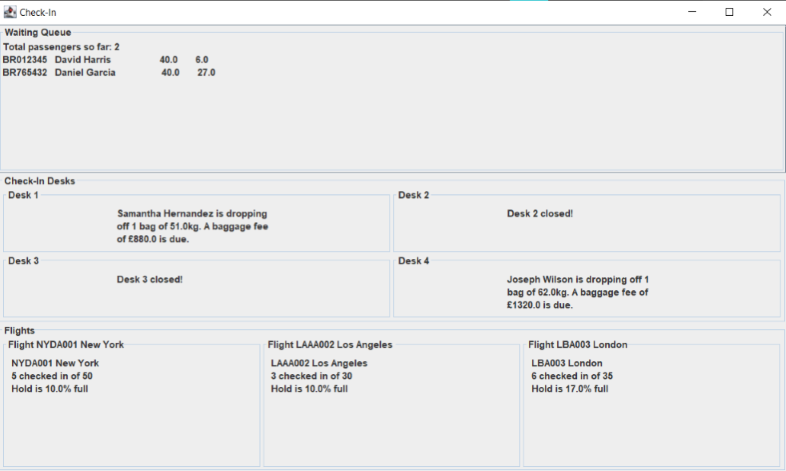

# flight-check-in
Using Java Thread and Swing to simulate passenger checking-in flights. Also creates an excutable jar file for the simulation.

| Runtime dialog ||
|----------------|-----------------------------|
|Main GUI        |||

- A running simulation

## Getting started
If you are running it in the Eclipse IDE pretty much everything is available. Just clone and move the `src\` and `data\` to your project.

Below are the guides for running it through a terminal.
### Pre-requisite
- [JDK 21](https://adoptium.net/temurin/releases)
- [JUnit 5 (Standalone)](https://docs.junit.org/current/user-guide/#running-tests-console-launcher)
- To check if you have Java installed
    ```sh
    java -version
    ```

### Installation
1. Clone the repository
    ```sh
    git clone https://github.com/YanMinChan/flight-check-in.git
    ```
2. Compile and build the application
    ```sh
    javac -cp <your-junit.jar> -d bin\ src\*.java
    jar cfm check-in-kiosk.jar manifest.txt -C bin . -C data .
    ```
3. Run the `jar` file
    ```sh
    java -jar check-in-kiosk.jar
    ```

